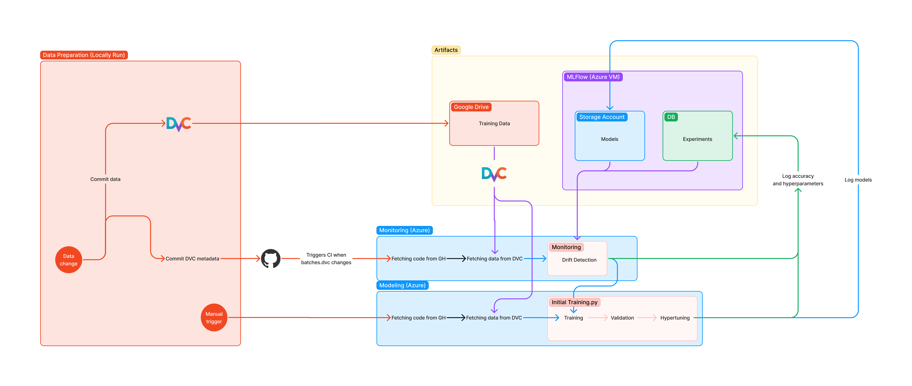

# Rain Prediction — Australia

## Table of contents
1. [Table of contents](#table-of-contents)
1. [Project aim](#project-aim)
2. [Architecture](#architecture)
3. [Data architecture](#data-architecture)
    1. [DVC](#dvc)
4. [Running the project](#running-the-project)
    1. [Docker way](#docker-way)
        1. [Requirements](#docker-requirements)
        2. [Initial training](#initial-training)
        3. [Drift detection](#drift-detection)
    2. [Running the app on host](#running-the-app-on-host)
        1. [Requirements](#docker-host)
        2. [Run initial training](#run-initial-training)
        3. [Drift detection](#drift-detection)
5. [Authors](#authors)

## Project aim
The aim of this project is to predict the precipitation for a given day based on a number of other weather parameters (like temperature, sunshine, wind direction and speed, etc.)

As any weather based ML project the use-case for this project is usage in weather forecasts.

The dataset contains about 10 years of daily weather observations from numerous Australian weather stations.
> Data source: https://www.kaggle.com/datasets/jsphyg/weather-dataset-rattle-package

## Architecture


## Data architecture
All of the data is stored using [DVC](https://dvc.org/).
```
data/
├─ batches/ ← Batches of data to be trained/checked (0.csv should be initial data)
├─ source/ ← Source of data
```

### DVC
To pull the latest data run the following command and follow the instructions
```bash
dvc pull
```

## Running the project
### Docker way
<h4 id="docker-requirements">Requirements</h4>

| Dependency      | Oldest checked version |
| --------------- | ---------------------- |
| Docker Engine   | 20.10.13               |
| DVC             | 2.11.0                 |

Pull the latest training data from DVC using the instructions in [DVC step](#dvc).

#### Initial training
```bash
docker-compose -f docker-compose.train.local.yml up --build --abort-on-container-exit
```

#### Drift detection
```bash
docker-compose -f docker-compose.drift.local.yml up --build --abort-on-container-exit
```

#### Running MLFlow only
```bash
docker-compose -f docker-compose.drift.local.yml up mlflow --build --abort-on-container-exit
```

### Running the app on host
<h4 id="docker-host">Requirements</h4>

| Dependency      | Oldest checked version |
| --------------- | ---------------------- |
| Python          | 3.9.13                 |
| Conda           | 4.12.0                 |
| DVC             | 2.11.0                 |

1. Create conda environment
```
conda env create --file environment.yaml
```
3. Pull the latest training data from DVC using the instructions in [DVC step](#dvc).

2. After that run the following in a new terminal window command to start mlflow server
```bash
mlflow server --backend-store-uri=sqlite:///db/mlrunsdb15.db --default-artifact-root=file:mlruns --host 0.0.0.0 --port 5001
```

#### Run initial training
```bash
conda run --name asi3 python 1_initial_train.py
```

#### Drift detection
```bash
conda run --name asi3 python 2_drift_detection.py
```

## Authors
* Bartosz Legięć (s19129)
* Romeo Morcia (s19266)
* Maciej Wójcik (s18305)
